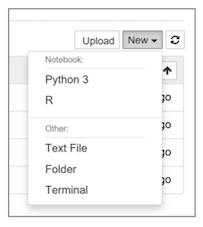

# Configuración de Mac OS

Esta guía describe el proceso de instalación y configuración de Anaconda (que
incluye Python, IPython y Jupyter), el lenguaje R, RStudio y los kernels para
Jupyter de R (IRkernel) y Bash (IBash) en el sistema operativo macOS.


### Paso 1 (Anaconda Python)
Descargue del sitio [https://www.continuum.io/downloads](https://www.continuum.io/downloads) el
instalador de Python 3.7 – Anaconda para OS X.


### Paso 2
Ejecute el instalador y acepte todas las opciones por defecto.


### Paso 3 (Lenguaje R)
Descargue el instalador del lenguje R del sitio
[https://www.icesi.edu.co/CRAN/](https://www.icesi.edu.co/CRAN/)
haciendo click en **`Download R for (Mac) OS X`**.

### Paso 4
Descargue y ejecute el instalador.


### Paso 5
Una vez finalice la instalación, abra ``Terminal`` en
**``Finder > Aplicaciones > Utilidades > Terminal.``**.

### Paso 6
En Terminal ejecute **`R`** para abrir el interprete del lenguaje R en la
consola de comandos.


### Paso 7
En **`R`** ejecute el siguiente comando para actualizar la configuración
internacional en el interprete del lenguaje.

```
> system('defaults write org.R-project.R force.LANG en_US.UTF-8')
```

### Paso 8
Luego ejecute los siguientes comandos en el prompt de **`R`** para instalar
el ``IRkernel``.

```
> install.packages('repr')
> install.packages('IRdisplay')
> install.packages('evaluate')
> install.packages('crayon')
> install.packages('pbdZMQ')
> install.packages('devtools')
> install.packages('uuid')
> install.packages('digest')
> devtools::install_github('IRkernel/IRkernel')
> IRkernel::installspec(user = FALSE)
```

### Paso 9
Salga de **`R`** con:
```
> quit()
```

### Paso 10
Verifique que el kernel de ``R`` fue instalado correctamente. Abra jupyter desde
``Terminal`` con el siguiente comando:
```
$ jupyter notebook
```
En el menú **`New`** de Jupyter debe aparece la opción de crear notebooks que
usen el lenguaje R.



### Paso 11 (RStudio)
Vaya a la pagina [https://www.rstudio.com/products/RStudio/](https://www.rstudio.com/products/RStudio/)
y descargue RStudio Desktop.

### Paso 12
Ejecute el instalador.


### Paso 13 (IBash)
Abra ``Terminal`` y ejecute los siguientes comandos para Instalar IBash.
```
$ pip install bash_kernel
$ python -m bash_kernel.install
```

### Paso 14
Verifique que en el menú **`New`** de Jupyter debe aparece la opción de crear notebooks en Bash.


